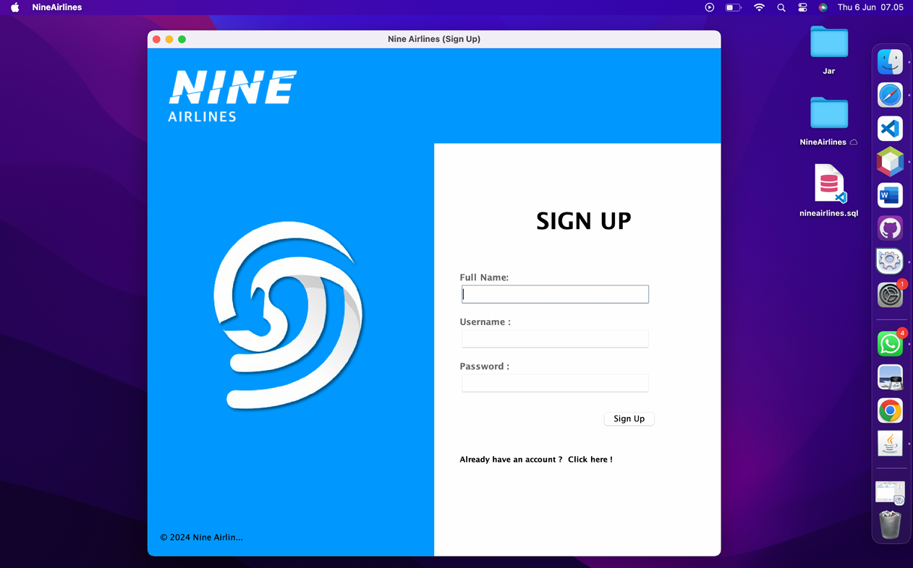
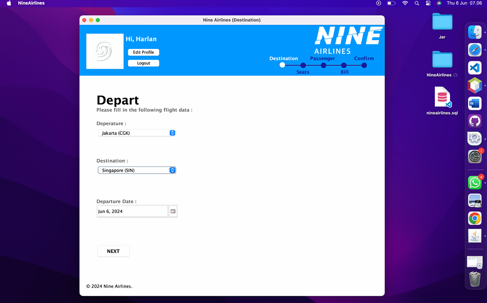
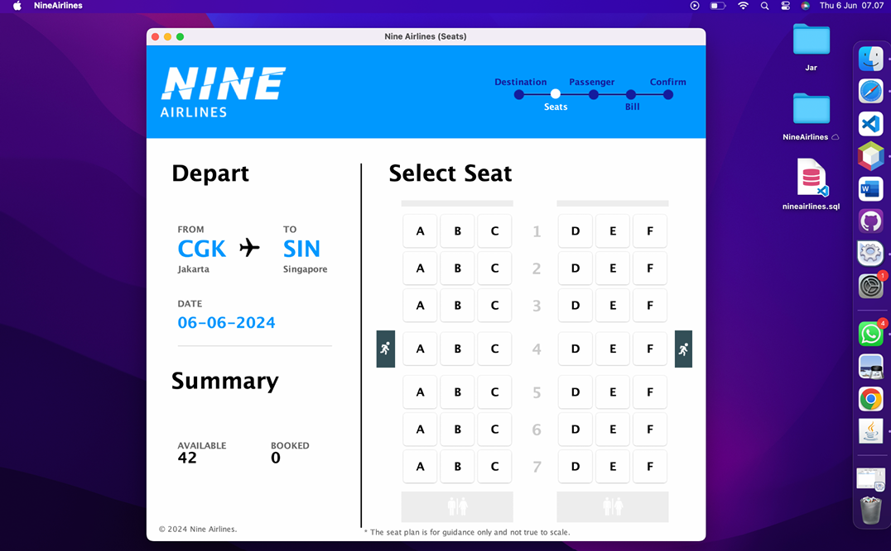
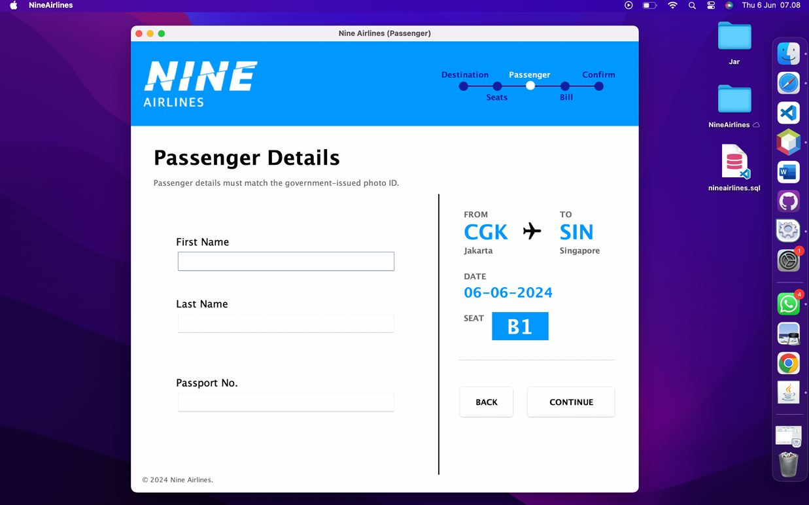
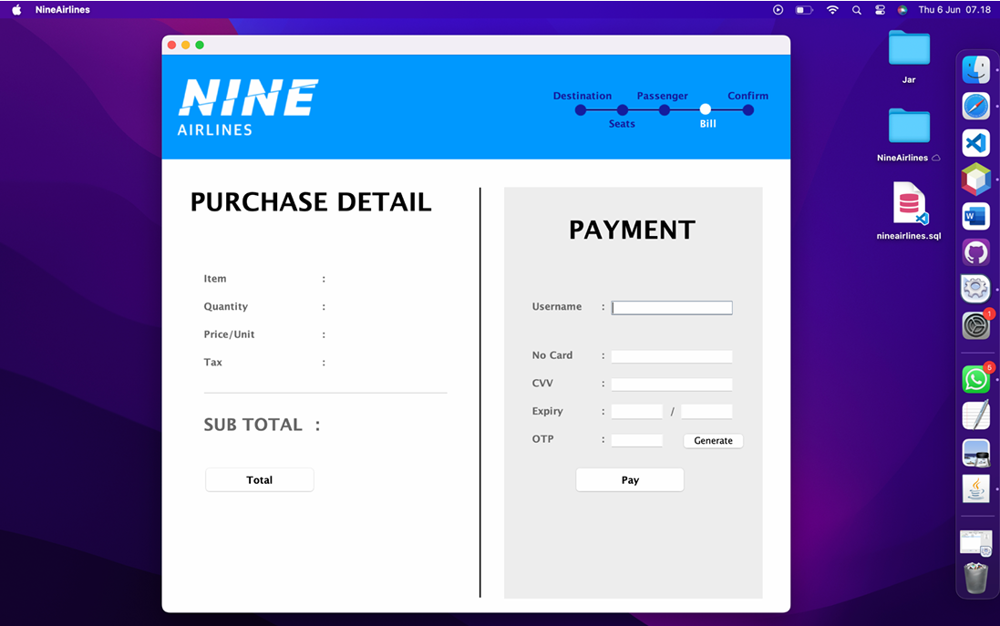
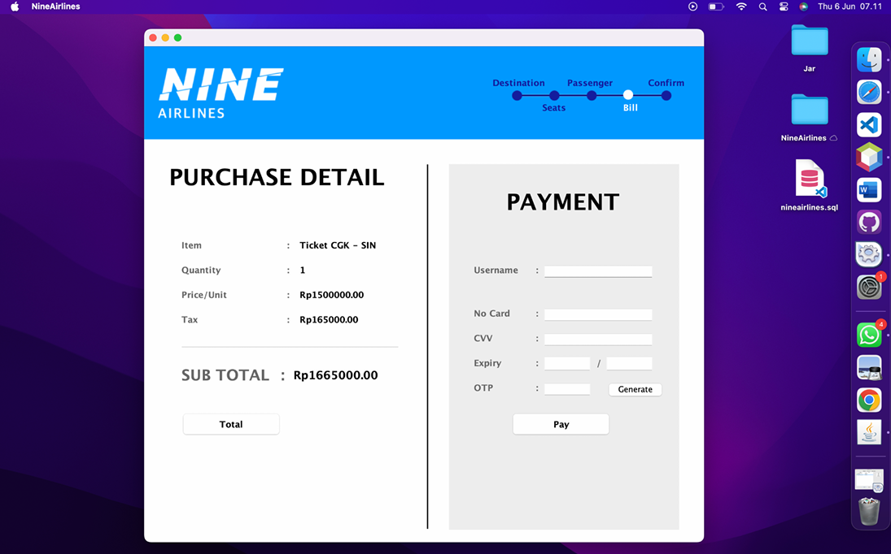
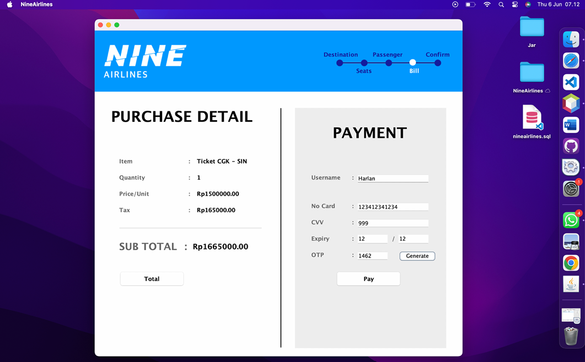
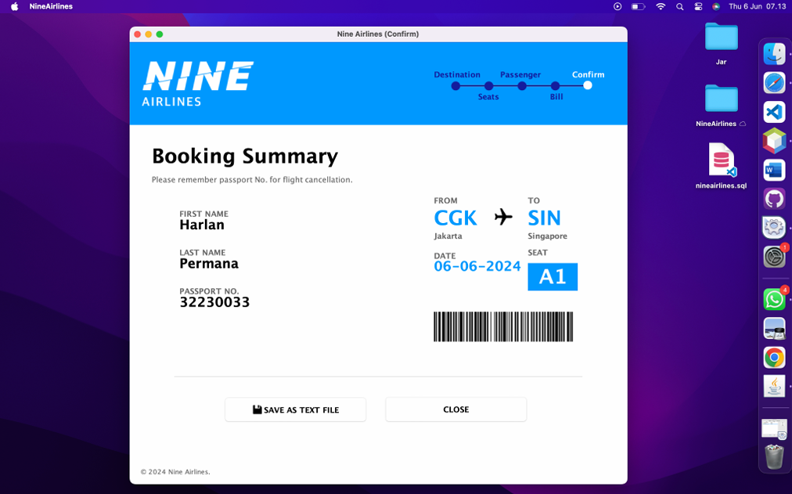
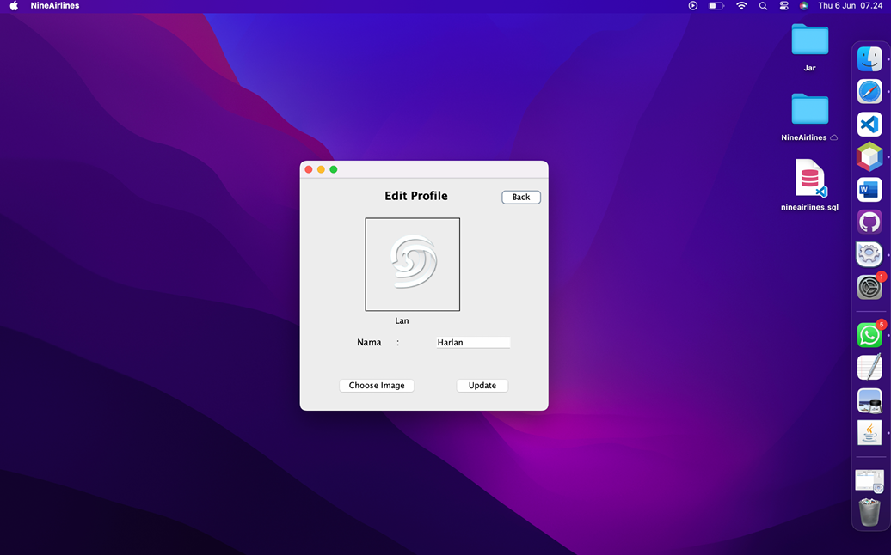

# Nine Airlines Reservation System

A desktop-based airline reservation system developed using Java Swing and MySQL. This application allows users to register, log in, manage profiles, search flight destinations, select seats, and book flight tickets through an interactive graphical user interface (GUI).

---

## Project Overview

Nine Airlines Reservation System is a Java desktop application designed to simplify airline ticket booking processes. The system provides a complete workflow starting from user registration and login, selecting departure and destination airports, choosing available seats, entering passenger information, and generating booking details.

The application was developed as an academic project for the Object-Oriented Programming course.

---

## Features

### Authentication System
- User Registration (Sign Up)
- User Login
- Logout Functionality
- Session Management

### Profile Management
- View Profile Information
- Edit User Profile
- Upload and Update Profile Picture
- Display User Information after Login

### Flight Reservation
- Select Departure and Destination Airports
- Choose Flight Date
- Input Passenger Information
- Seat Selection System
- Real-Time Seat Availability
- Booking Confirmation

### Seat Management
- Display Available Seats
- Display Booked Seats
- Prevent Double Booking
- Interactive Seat Map

### Booking Information
- Passenger Details
- Flight Summary
- Booking Records

---

## Application Workflow

```text
Sign Up/Login
      ↓
Destination Selection
      ↓
Flight Information
      ↓
Seat Selection
      ↓
Passenger Information
      ↓
Booking Confirmation
```

---

## Technologies Used

| Technology | Description |
|------------|-------------|
| Java SE | Main programming language |
| Java Swing | Graphical User Interface |
| NetBeans IDE | Development environment |
| MySQL | Database Management System |
| JDBC | Database Connectivity |
| JCalendar | Date Picker Component |
| JasperReports | Report Generation |

---

## Project Structure

```text
NineAirlines/
│
├── src/
│   ├── Customer/
│   ├── Model/
│   ├── Service/
│   ├── Connection/
│   └── Admin/
│
├── Image/
├── lib/
├── nbproject/
├── nineairlines.sql
└── README.md
```

---

## Database Setup

### 1. Create Database

```sql
CREATE DATABASE nineairlines;
```

### 2. Import Database

Import:

```text
nineairlines.sql
```

using phpMyAdmin or MySQL Workbench.

---

## Database Configuration

```java
Connection con = DriverManager.getConnection(
        "jdbc:mysql://localhost:3306/nineairlines",
        "root",
        ""
);
```

Default configuration:

| Property | Value |
|----------|--------|
| Database | nineairlines |
| Username | root |
| Password | (empty) |

---

## Requirements

- Java JDK 8 or higher
- NetBeans IDE
- MySQL Server / XAMPP
- MySQL Connector/J
- JCalendar Library
- JasperReports Library

---

## Installation

### Clone Repository

```bash
git clone https://github.com/your-username/NineAirlines.git
```

### Open Project

Open the project using:

```text
NetBeans IDE
```

### Import Database

Import:

```text
nineairlines.sql
```

into MySQL.

### Add Required Libraries

- mysql-connector-j
- jcalendar.jar
- jasperreports.jar

### Run Project

```text
Run Project (F6)
```

---

## Screenshots

### Login Page/Sign Up Page



### Destination Selection


### Seat Booking



### Bill




### Confirmation


### Profile Page


---

## Developers

- Reynaldi
- Richard Stefano
- Harlan Luthi Permana
- Denis Wilbert

---

## Academic Project

This project was developed as a final project for the Object-Oriented Programming course using Java Swing and MySQL. The application implements concepts such as:

- Object-Oriented Programming (OOP)
- GUI Development
- Database Connectivity (JDBC)
- Event Handling
- File and Image Processing
- Multi-Form Navigation
- CRUD Operations

---

## License

This project is intended for educational purposes only.